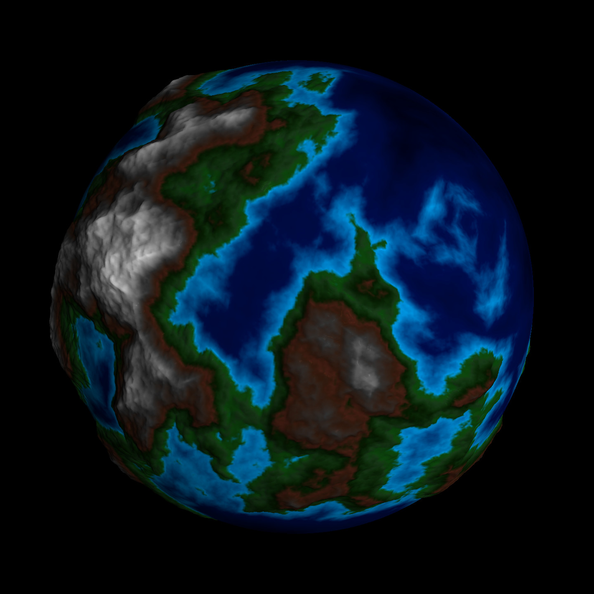

# godefarig
A (kind of) spherical terrain generator.

The aim of this project is to experiment with procedural generation in order to render a planet.
Here is one such planet:

## Current state

This project is no longer actively developed, its successor resides at https://github.com/mooss/yliss.

It is able to create elevation and coloration on the cpu side.

It uses an octahedral base, every triangular face being divided into four smaller triangles at each iteration.

## OS

This project was only tested on GNU/Linux.
The code might work under other OSes but will probably require some tweaking.

## Dependencies

You will need boost installed in order to compile this program (last version should be fine).

This program also uses glfw3. A source version is provided but I would recommend installing it via your package manager if possible.

Depending on your distribution, you might need to install something like xorg-dev.

In addition to boost and glfw3, this program uses the following libraries:
- glm
- glad
- OpenGL

## Compilation (out-of-source build)

From the build/ folder, launch the following commands:

`cmake ..`

`make -j6 gltest`

## Usage

The res/ folder contains a number of configurations (.gfg files) which can be used as such:

`./gltest --config res/name_of_the_file.gfg`

alternatively, the option --help outputs a description of the main options

## Controls

- WASD moves the camera, mouse movements orientates it.
- U enables face culling
- I changes the face to be culled
- O toggles depth testing
- P changes the drawing primitive (GL_LINE, GL_FILL, GL_POINT)
- K dereases the size of the primitive
- L increases the size of the primitive
- B decreases camera speed and N increases camera speed, but that's pretty anecdotical
- W decreases the drawing stage
- X increases the drawing stage

## Licence

The licence is currently GPLv3, because I like the notion of copyleft for this particular project.

But I feel that the intricacies of software licencing are lost on me, so this might change when I'll know more about it.
